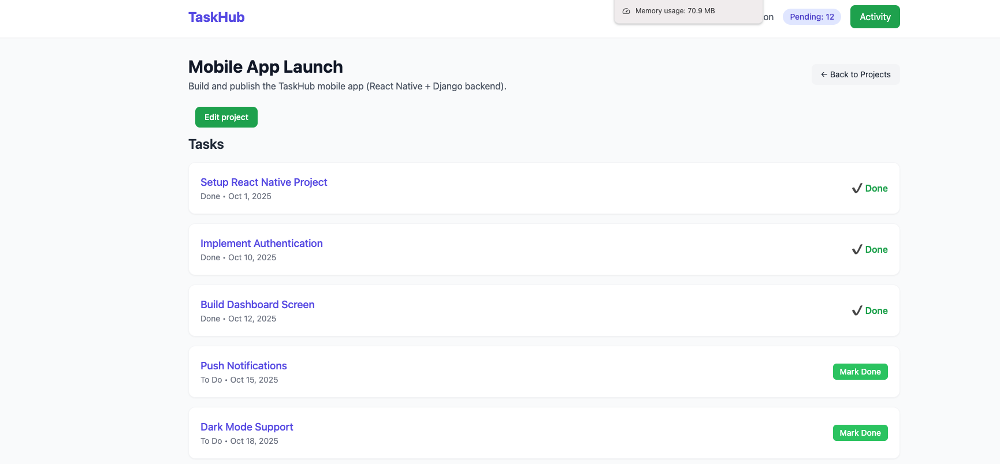

# TaskHub Documentation

## Overview
**TaskHub** is a full-featured task management application designed to help teams organize projects, manage tasks, and keep track of activity in a streamlined way. It combines a modern, responsive design with a robust backend system, enabling users to create projects, assign tasks, set priorities, and monitor progress in real-time.

The app is built with **Django** as the backend framework and **Tailwind CSS** for the frontend, giving it a clean, user-friendly interface that works on both desktop and mobile devices.

---

## Key Features
- **Project Management:** Create and manage multiple projects, each with its own description and assigned team members. Projects serve as containers for tasks.
- **Task Management:** Tasks have a title, description, status (e.g., To Do, In Progress, Done), priority, and due date. Assign tasks to specific users for accountability.
- **Activity Tracking:** Logs all actions automatically, including task creation, updates, completion, and deletion.
- **Notifications:** Unread notifications alert users to new actions related to their tasks or projects.
- **Tailwind UI:** Fully responsive, card-based layouts with colored status badges and intuitive forms.

---

## User Workflow
1. **Creating a Project:** Start by creating a project with a name and description. Projects can represent initiatives, campaigns, or development efforts.
2. **Adding Tasks:** Add tasks to the project, specifying status, priority, due date, and assigned user.
3. **Tracking Progress:** Update task statuses from To Do → In Progress → Done. All actions are logged in the activity feed.
4. **Monitoring Notifications:** Check notifications for updates on tasks assigned or changes in projects.
5. **Reviewing Activity Feed:** View all recent actions, such as task creation, updates, completion, or deletion.

---

## Architecture Overview
- **Backend:** Django handles data storage, authentication, task and project management, and activity logging.
- **Models:** Includes `Projects`, `Tasks`, and `ActivityLogs`.
- **Signals:** Automatically log all project and task actions.
- **Frontend:** Tailwind CSS for modern, responsive UI with cards, badges, and forms.
- **Notifications:** Users are informed of updates through a notification system linked to the activity logs.

---

## Sample Use Cases
- **Software Development Teams:** Track sprints, assign tickets, and monitor task progress.
- **Marketing Campaigns:** Organize campaigns, schedule tasks, and view performance at a glance.
- **Personal Task Management:** Manage multiple personal projects with due dates and priorities.

---

## Future Enhancements
- Real-time updates using WebSockets or Django Channels for instantaneous notifications.
- Recurring tasks and reminders for repetitive workflows.
- Advanced filtering and search features for tasks and projects.
- Analytics dashboards for project progress, overdue tasks, and productivity trends.
- Email and push notifications for task assignments and project updates.

---

## Conclusion
**TaskHub** provides a clean, intuitive interface for managing projects and tasks while ensuring transparency through activity logging and notifications. Its combination of a powerful backend with a modern frontend makes it suitable for teams and individuals who want to stay organized and productive.
